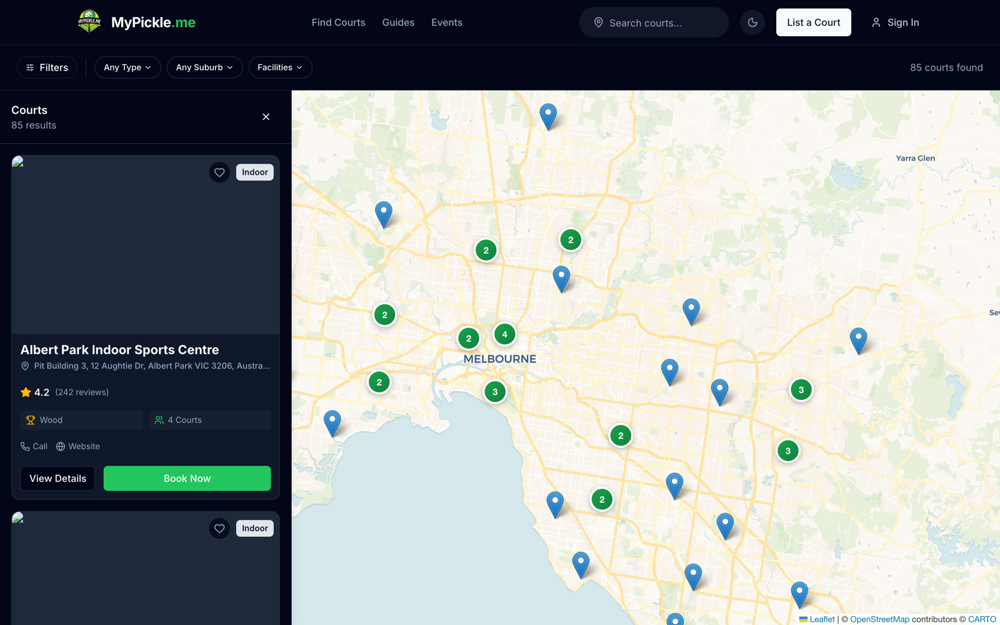
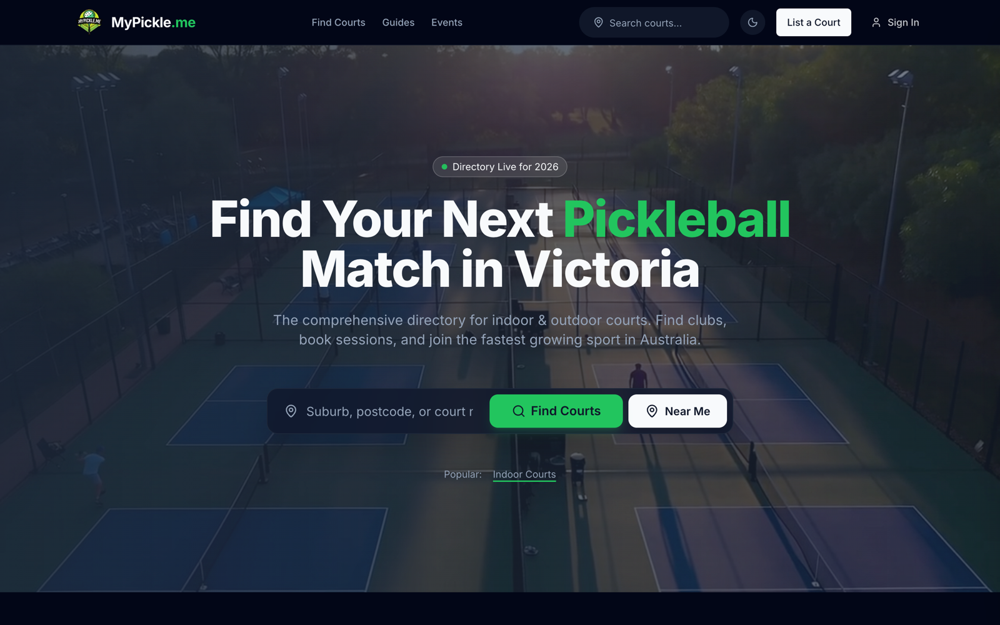
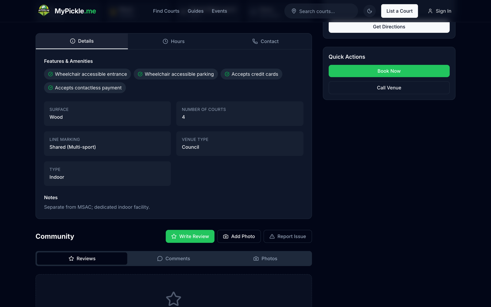

# MyPickle

**Victoria's pickleball court directory — every venue on one interactive map, kept honest by the players who use them.**

<p align="center">
  <a href="https://mypickle.me"></a>
  <a href="LICENSE"></a>
  
</p>

<p align="center">
  <a href="https://mypickle.me">Live site</a> ·
  <a href="#features">Features</a> ·
  <a href="#tech-stack">Tech stack</a> ·
  <a href="#data-pipeline">Data pipeline</a> ·
  <a href="#local-development">Local development</a>
</p>

<p align="center">
  
</p>

## Features

- **Interactive court map** — every venue in Victoria with marker clustering and a density heat map, with filtering by court type, suburb and facilities.
- **Crowd-sourced ratings, reviews and photos** — signed-in players rate courts, write reviews, comment, and upload photos; favourites sync to your profile.
- **Court detail pages** — surface, court count, line markings, accessibility features, opening hours, and booking/contact actions per venue.
- **Community submissions** — anyone can list a new court (`/list-court`); submissions land in a password-gated admin dashboard for review.
- **Suburb landing pages** — `/courts/[suburb]` SEO pages with internal linking, plus `sitemap.ts` and `robots.ts` for search indexing.
- **Auth-gated contributions** — Supabase Auth (Google or email/password) protects reviews, photos, favourites and submissions.
- **Dark/light theme** — system-aware toggle via `next-themes`.

<p align="center">
  
  
</p>

## Tech stack

| Layer | Choice |
|---|---|
| Framework | [Next.js](https://nextjs.org) 16 (App Router) + React 19 + TypeScript 5 |
| Styling | Tailwind CSS v4, `next-themes`, `lucide-react` |
| Database & auth | [Supabase](https://supabase.com) (Postgres + Auth, `@supabase/ssr`) |
| Maps | Leaflet 1.9 + react-leaflet 5, `react-leaflet-cluster`, `leaflet.heat` |
| Enrichment | Google Places API (opening hours, photos, place data) |
| Hosting | Vercel |

## Data pipeline

The directory isn't hand-typed — it's seeded and enriched from source data:

1. **Source CSV** — [`victoria_pickleball_courts_updated.csv`](victoria_pickleball_courts_updated.csv) holds 85 Victorian venues with surface, court count and notes.
2. **Seed** — `npm run seed` loads the CSV into Supabase ([`scripts/seed-courts.ts`](scripts/seed-courts.ts)).
3. **Enrich** — `npm run enrich` matches each venue against the Google Places API and fills in opening hours, photos and place metadata ([`scripts/enrich-courts.ts`](scripts/enrich-courts.ts)).

Community reviews, photos and new-court submissions then layer player knowledge on top of the seeded base.

## Local development

> [!NOTE]
> The Supabase schema isn't committed to this repo, so a fresh clone can't stand up the database on its own — local runs need your own Supabase project with the expected tables. **The [live site](https://mypickle.me) is the primary demo.**

Prerequisites: Node.js 20+ (required by Next.js 16) and a Supabase project.

```bash
git clone https://github.com/Zacplischka/pickle-me.git
cd pickle-me
npm install

cp .env.example .env.local   # then fill in your values
npm run dev                  # http://localhost:3000
```

All required variables are listed in [`.env.example`](.env.example): Supabase URL/keys, Google Places keys (needed for the enrich script and place autocomplete), the public site URL, and the admin dashboard password.

```bash
npm run lint     # eslint
npm run build    # production build
npm run seed     # CSV → Supabase (needs service-role key)
npm run enrich   # Google Places enrichment (needs Places key)
```

## Deployment

Deployed on [Vercel](https://vercel.com) with the canonical domain [mypickle.me](https://mypickle.me). Push to `main` deploys; environment variables are configured in the Vercel project.

## License

[MIT](LICENSE) © Zac Plischka
